# AKS Deployment with Terraform & Azure DevOps

> **Enterprise-grade Infrastructure as Code for Azure Kubernetes Service**  
> A reference implementation demonstrating realistic IaC patterns, secure identity management, and pipeline-driven infrastructure provisioning.

---

## 📋 Table of Contents

- [Overview](#overview)
- [Architecture](#architecture)
- [Key Features](#key-features)
- [Project Flow](#project-flow)
- [Terraform Design](#terraform-design)
- [Security & Identity](#security--identity)
- [Azure DevOps Pipelines](#azure-devops-pipelines)
- [Production Considerations](#production-considerations)
- [Learning Resources](#learning-resources)

---

## 📌 Overview

This project demonstrates a **production-ready workflow** for deploying Azure Kubernetes Service (AKS) using:

- **Infrastructure as Code** with Terraform (modular, environment-aware)
- **CI/CD Automation** via Azure DevOps Pipelines
- **Secure Identity Management** with Azure Entra ID & Key Vault
- **Multi-Environment Support** (dev, staging, production-ready)

Rather than oversimplifying AKS deployment, this implementation reflects **how infrastructure is actually managed** in real enterprise environments—with explicit permissions, remote state management, and pipeline-controlled lifecycles.

### 🎯 What This Project Teaches

✅ Terraform best practices (modules, remote state, environment separation)  
✅ Pipeline-driven infrastructure provisioning  
✅ Azure identity and RBAC patterns  
✅ Secure secrets management  
✅ Real-world infrastructure challenges and solutions  

---

## 🏗️ Architecture

```
┌─────────────────────────────────────────────────────────────┐
│                      GitHub Repository                       │
└────────────────────────┬────────────────────────────────────┘
                         │
                         ▼
┌─────────────────────────────────────────────────────────────┐
│                 Azure DevOps Pipelines                       │
│  (Validate → Plan → Apply → Deploy / Destroy)               │
└────────────────────────┬────────────────────────────────────┘
                         │
        ┌────────────────┼────────────────┐
        ▼                ▼                ▼
┌──────────────┐  ┌──────────────┐  ┌──────────────┐
│   Terraform  │  │  Azure Entra │  │ Azure Storage│
│   Modules    │  │      ID      │  │   (State)    │
└──────────────┘  └──────────────┘  └──────────────┘
        │                │                │
        └────────────────┼────────────────┘
                         ▼
        ┌────────────────────────────────┐
        │  Azure Resources               │
        │  ├─ Resource Groups            │
        │  ├─ Service Principals         │
        │  ├─ Key Vault (Secrets)        │
        │  └─ AKS Cluster                │
        └────────────────────────────────┘
```

### 🔧 Core Components

| Component | Purpose |
|-----------|---------|
| **Terraform** | Infrastructure provisioning & lifecycle management |
| **Azure DevOps Pipelines** | CI/CD orchestration & deployment automation |
| **Azure Storage Account** | Remote Terraform state (per environment) |
| **Azure Key Vault** | Secure secret storage |
| **Azure Entra ID** | Service Principal & RBAC |
| **AKS Cluster** | Kubernetes container orchestration |
| **GitHub** | Source control (pipelines in Azure DevOps) |

---

## ✨ Key Features

### 🔄 Multi-Environment Support
- **Dev** and **Staging** environments pre-configured
- Environment-specific variables and state files
- Production-ready architecture patterns

### 🔐 Enterprise Security
- Azure Entra ID for identity management
- Service Principal with granular RBAC
- Secrets stored in Azure Key Vault (not in code)
- Remote Terraform state with locking

### 🚀 Automated Pipelines
- Trigger on GitHub push
- Terraform validate → plan → apply workflow
- Separate destroy pipeline for safety
- Health checks & dependency ordering

### 📦 Modular Design
- Reusable Terraform modules (AKS, Key Vault, Service Principal)
- Clear separation of concerns
- Environment-aware configurations
- Explicit dependency management

---

## 🔁 End-to-End Flow

```mermaid
graph LR
    A["Code Push to GitHub"] --> B["Azure DevOps Pipeline Triggered"]
    B --> C["Service Principal Authentication"]
    C --> D["Terraform Init + Validate"]
    D --> E["Infrastructure Plan"]
    E --> F["Apply Modules in Order"]
    F --> G["Resource Group"]
    G --> H["Service Principal"]
    H --> I["Key Vault"]
    I --> J["AKS Cluster"]
    J --> K["Secrets Stored in KV"]
    K --> L["State Persisted Remotely"]
    L --> M["Environment Ready ✅"]
```



### Step-by-Step Execution

1. **Code Commit** → Push changes to GitHub `main` branch
2. **Pipeline Trigger** → Azure DevOps detects changes
3. **Authentication** → Pipeline authenticates using Service Principal
4. **Terraform Init** → Initialize with remote backend
5. **Infrastructure Modules** → Apply in dependency order:
   - Resource Group
   - Service Principal
   - Key Vault
   - AKS Cluster
6. **Secrets Management** → Store credentials in Key Vault
7. **State Management** → Persist Terraform state remotely
8. **Output** → Kubeconfig generated for cluster access

### Teardown (Controlled Destruction)

```bash
# Triggered manually via Azure DevOps
terraform destroy --auto-approve
```

---

## 📦 Terraform Design

### 📁 Project Structure

```
iac-terraform-aks-azure/
├── dev/                           # Development environment
│   ├── main.tf                    # Resource & module definitions
│   ├── variables.tf               # Input variables
│   ├── backend.tf                 # Remote state configuration
│   ├── terraform.tfvars           # Environment-specific values
│   └── kubeconfig                 # Generated kubeconfig (local)
│
├── staging/                       # Staging environment
│   ├── main.tf
│   ├── variables.tf
│   ├── backend.tf
│   ├── terraform.tfvars
│   └── kubeconfig
│
├── modules/                       # Reusable Terraform modules
│   ├── aks/                       # AKS cluster configuration
│   │   ├── main.tf
│   │   ├── variables.tf
│   │   └── output.tf
│   ├── keyvault/                  # Azure Key Vault setup
│   │   ├── main.tf
│   │   ├── variables.tf
│   │   └── output.tf
│   └── ServicePrincipal/          # Azure Entra ID identity
│       ├── main.tf
│       ├── variables.tf
│       └── output.tf
│
├── pipelines/                     # Azure DevOps pipeline definitions
│   ├── create.yml                 # Validation & apply pipeline
│   └── destroy.yml                # Destruction pipeline
│
├── scripts/                       # Setup & utility scripts
│   └── dev.sh                     # Backend infrastructure setup
│
├── provider.tf                    # Provider configuration
├── output.tf                      # Root outputs
└── README.md
```

### 🎯 Key Design Patterns

| Pattern | Benefit |
|---------|---------|
| **Modular Architecture** | Reusability across environments |
| **Remote Backend** | Team safety, state locking |
| **Environment Variables** | Dev/staging/prod separation |
| **Explicit Dependencies** | Prevent race conditions |
| **Output Values** | Kubeconfig, IDs for downstream use |

---

## 🔐 Security & Identity

### 🔑 Identity Management

This project manages Azure Entra ID identities **as infrastructure** rather than manually. This approach:

✅ **Avoids License Dependencies** — Works without Entra ID P1  
✅ **Uses Microsoft Graph API** — License-agnostic automation  
✅ **Reflects Real-World Practices** — How enterprises actually implement it  
✅ **Fully Automated** — Pipelines, not humans, control identities  

### 🛡️ Service Principal Configuration

The Service Principal is granted:

```
Scope: Subscription Level
├─ Contributor Role
│  └─ Resource creation & role assignments
└─ Key Vault Contributor Role
   └─ Secrets & RBAC management
```

**⚠️ Production Consideration**: This is intentionally broad for the reference implementation. In production, use narrower scopes and custom roles for least-privilege access.

### 🔒 Key Vault Permissions

Data-plane permissions are explicitly managed:

```
Service Principal → Key Vault Access
├─ get (read secrets)
├─ set (create secrets)
└─ delete (cleanup)
```

**Important**: Subscription-level roles alone don't grant secret access. Data-plane RBAC must be configured explicitly.

### 📋 Required Permissions for CI/CD

The Azure DevOps Service Connection requires:

- ✅ Create App Registrations
- ✅ Create Service Principals
- ✅ Assign roles at subscription scope
- ✅ Create/manage Key Vault secrets
- ✅ Create/manage AKS clusters

These are managed via Microsoft Graph API permissions.

---

## ⚙️ Azure DevOps Pipelines

### 📜 Available Pipelines

#### **1. Create Pipeline** (`pipelines/create.yml`)

Automatically triggered on push to `main` branch.

```yaml
Stages:
├─ Validate
│  └─ Terraform validate & syntax check
├─ Dev Deploy
│  └─ Apply infrastructure to dev environment
└─ Staging Deploy
   └─ Apply infrastructure to staging environment
```

**Triggers:**
- Push to `main` branch
- Push to `feature/*` branches (validate only)

#### **2. Destroy Pipeline** (`pipelines/destroy.yml`)

Manual trigger for controlled infrastructure teardown.

```yaml
Parameters:
├─ environment: dev | staging

Stages:
├─ Plan Destroy
│  └─ Show what will be destroyed
└─ Destroy
   └─ Remove infrastructure
```

**Trigger:** Manual (via Azure DevOps UI)

### 🔄 Pipeline Workflow

```
GitHub Push
    ↓
Azure DevOps Trigger
    ↓
Pool: Self-Hosted (KR_Pool)
    ↓
Terraform Installer (1.7.5+)
    ↓
Backend Init
    ├─ Storage Account: tfdevbackend2026kr (dev)
    └─ Storage Account: tfstagebackend2026kr (staging)
    ↓
Validate/Plan/Apply
    ├─ Service Principal Auth
    └─ Environment Variables Injected
    ↓
Status Report
```

### 🖥️ Self-Hosted Runner

Pipelines run on a **self-hosted agent** (`KR_Pool`) with:

- Terraform 1.7.5+
- Azure CLI
- Git
- Network access to Azure

---

## 🚧 Production Considerations

### 🔐 Enhanced Security

- [ ] Separate Azure subscriptions per environment
- [ ] Private AKS clusters (no public IP)
- [ ] Network policies & Azure Policy enforcement
- [ ] Pod security policies / Pod Security Standards
- [ ] Network segmentation (VNets, NSGs)

### 🔑 Identity & Access

- [ ] Workload Identity for pod-to-Azure authentication
- [ ] Custom RBAC roles (least-privilege)
- [ ] Service Principal rotation policies
- [ ] Audit logging for identity operations

### 📊 Observability

- [ ] Azure Monitor integration
- [ ] Terraform state monitoring
- [ ] Pipeline run history & alerts
- [ ] Cost management & budgets
- [ ] Security Center recommendations

### 🚀 Deployment

- [ ] GitOps-based application deployment (ArgoCD)
- [ ] Ingress controller (NGINX, Azure Application Gateway)
- [ ] Certificate management (cert-manager)
- [ ] Service mesh (Istio, Linkerd)

### 🛡️ Governance

- [ ] Pipeline approvals for production changes
- [ ] Automated compliance scanning
- [ ] Infrastructure change notifications
- [ ] Disaster recovery & backup procedures

---

## 📚 Learning Resources

### 🔗 Official Documentation

- [Terraform Azure Provider](https://registry.terraform.io/providers/hashicorp/azurerm/latest/docs)
- [Azure DevOps Pipelines](https://learn.microsoft.com/en-us/azure/devops/pipelines/)
- [Azure Kubernetes Service](https://learn.microsoft.com/en-us/azure/aks/)
- [Azure Key Vault](https://learn.microsoft.com/en-us/azure/key-vault/)

### 💡 Key Concepts

| Topic | Why It Matters |
|-------|----------------|
| **Remote State** | Team collaboration, locking, durability |
| **Modules** | Code reuse, maintainability, scaling |
| **Service Principals** | Automation, security, auditability |
| **RBAC** | Least-privilege access, compliance |
| **Pipelines** | Consistency, auditability, disaster recovery |

---

## 📝 Author's Notes

This project prioritizes **correct patterns** and **real-world practices** over simplicity:

- ✅ Identity managed as infrastructure (not manual)
- ✅ Explicit permissions (not over-permissioned)
- ✅ Modular design (not monolithic)
- ✅ Multi-environment support (not single-env)
- ✅ Pipeline-controlled (not manual deployments)

It's designed as a **reference implementation** for engineers learning enterprise IaC patterns, not a quick-start template.

---

## 📄 License

This project is provided as-is for educational and reference purposes.

---

**Questions or improvements?** Please open an issue or submit a PR! 🚀
